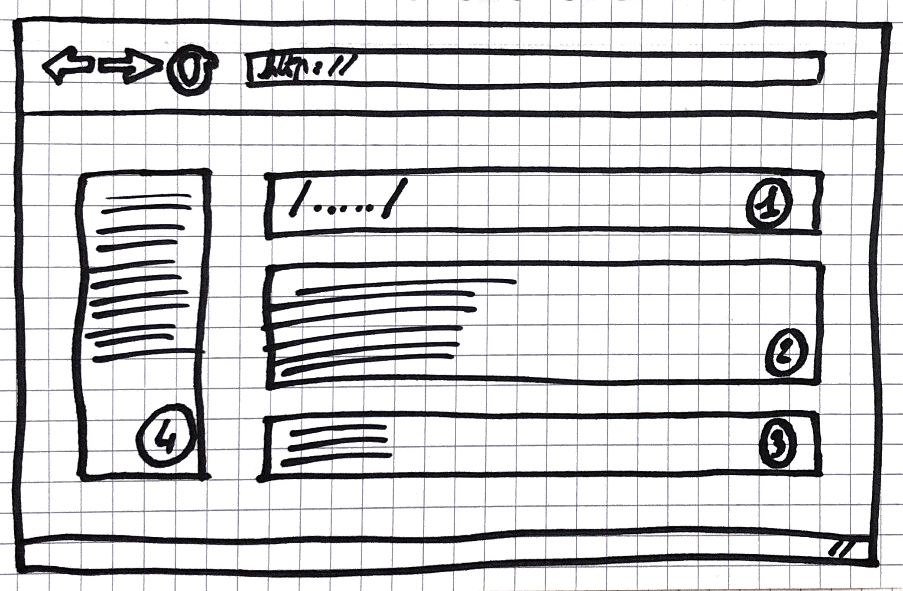
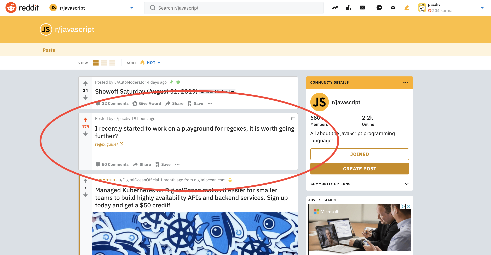

> This is the first episode of my journey to build an audience as a developer. Feel free to read [this introduction](/why-my-next-project-might-succeed/) that explains why I started this project.

\

---

"Fake it until you make it", how many times have we read this sentence?

Let's set up a compelling selling page, add it a five-dollar logo bought from a freelance designer on a specialized platform, spend dozens of bucks on ads to get some traffic to our selling page and we're good to go!

Let's wait a couple of weeks and compare this traffic with a total of hits on our "buy" or "pre-order" button.

If enough people hit this button, we know our idea is validated. The tactic has been proven for years so I was ready to apply it!

One thing troubled me though. My idea was an open source project. So people would have expected to see some source code. Was I supposed to pretend having a source code?

To me, this sounded like adding special effects to the movie and behind the scenes. I could not find any solution to this equation.

I had to come up with something else. So, I started coding.

---

## The context around the idea

In my introduction article, I said I'd learned from my failures, that I won't build any project without asking for feedback. But, for this open source project, I had to start somewhere.

At that time, my goal was to validate the idea without having to spend months coding on a final product. To do so, I set myself a short deadline: 10 days to build a proof of concept of my idea.

This idea was pretty simple: a playground for developers who need to experiment regular expressions. Among the online free tools I'd found, most of them looked like this schema below:

I noticed that, if you're just starting with regular expressions, coming up with something can be quite difficult.

As you can see, if you type your regular expression in the zone n°1 and enter in zone n°2 any text such as "regexes are like mathematics: frustrating until you manage to use them", you'll see results in zone n°3. The zone n°4 shares tips to help you to build your regular expression in zone n°1.

My opinion is that, if someone needs to discover and experiment something, the tool used should be as easy as possible to understand. The sooner the benefits are perceived, the sooner they will convince.

Considering this, I applied the fact that we usually know the _“what”_, what we want to extract from a regular expression. The _“how”_ remains the major issue.

This has led me to build a form where developers can define _what_ they need and the system suggests _how_ they might write their regular expressions. I thought it could help developers trying to get into regular expressions.

Then, I tried to validate the idea.

---

## Ask around for early feedback

A dozen days after I started to code, my proof of concept was ready to be tested so I put it online.

Wrong first impressions can not be fixed. So, at this stage of a project, I preferred asking people I knew personally such as members of my work team, developers I had met during previous experiences or courses.

Also, I would suggest asking locally like in a meetup, in small community discussion groups around a meetup or any other event.

What I define as ideal groups are the ones big enough to get feedback and small enough to be noticed. If you notice that very few messages get responses in a group, you know it's not what you're looking for.

More important than the number of people you will solicit, you must target people that will use your project, people that might need your project.

For my project, I asked three developers that were uncomfortable with regular expressions. Having feedback from them allowed me to validate if this project, still in its proof-of-concept phase, might help them at that moment.

Also, I asked feedback in a discussion group of ~60 javascript developers, where some of them know everything about regular expressions.

Their feedback helped me to understand that my proof of concept was not covering enough regex cases. However, the feedback highlighted that this project could help to explain regular expressions to other developers.

This feedback I received validated that it could help developers learning and/or trying regular expressions. What great news that was!

Thereafter, I wanted more feedback before spending months coding on this new project.

So, I started to target outside of my network. To avoid to get the same feedback, I improved the project by adding some more common regex cases and getting the UI.

---

## Get feedback far from your network

To share our works, there are some big players out there.

To maximize my chances to get valuable feedback, my priority was to find on which platforms developers are. As earlier in the process, I was looking for groups of discussions.

Developers are very active on twitter but I could not find groups there. Some Facebook groups and LinkedIn groups matched my size and activity requirements but I had to send requests to join them.

As for blogging platforms, to write an article seemed too much for me to get feedback.

It remained Reddit, the perfect candidate for what I needed. Since my project was written in javascript, I was interested to get feedback from javascript developers. So, I joined the subreddit r/javascript.

It's important to notice that Reddit is a place to discuss. This was convenient because my need was to get thoughts from redditors. If I needed to promote the project instead, sharing it on Reddit would have been inappropriate.

---

## Don't show the project, ask about it

Therefore, I published a post with the following question: "I recently started to work on a playground for regexes, it is worth going further?"

Beyond asking for feedback, I included redditors in my reflexion. Not to ask permission but to know if they thought it was worth it.

As for everyone, my time is precious. If the project could not help anyone, I would not have seen any reason to go further.

Yet, I won't suggest asking if it's worth it every single time, it depends on your needs.

However, I recommend asking on Reddit because it's a perfect platform to ask and to get responses. Pick one or two subreddits where your target users are and ask about your project.

Also, note that members of the community will take the time to try your project, read your readme and give you feedback. The least you can do is to thank them. Give a response as soon as possible to all of them, from the coolest one to the meanest one.

Moreover, be ready to accept critics. They allow you to highlight what it's important to them on your project and why. Since it's very early in your project's lifecycle, it's an opportunity for you to turn these critics into valuable features.

Let's get back to my study case. The results were above my expectations. The post has been on r/javascript's first page for around 24 hours! This allowed me to get around 30 feedback!

_(There are ~60 comments, half are mine because I answered to everyone)_

Some members of the community shared that they won't leave the tool they use such as regexr or regex101. Others shared that they would recommend it to other developers. A few of them pushed me to go further with the project!

More important than that, among the ones who understood that the project was meant for developers that do not use regular expressions, they all validated the idea.

---

## Find a process that matches your expectations

Now, my project's message is clearer: the Regex Guide is a playground helping developers to discover regular expressions.

More than that, I now know it needs more regexes cases, a better UI, and that it will help developers learning regular expressions.

What I learned during this period is that there are many ways to validate ideas.

Earlier, I could share it with my network without code. I was just too afraid to do it and it turned out to be a more convincing project with a UI to try and a code to read.

Also, late in the process, I could have asked in other subreddits and some Discord groups to get more feedback.

The most important thing is to set a process that matches your expectations.

As a takeaway, here's a summary of my process:\
– Define a target, and what  main issues the project can solve (and how);\
– Define yourself a short deadline to build a proof-of-concept;\
– Build your proof of concept which must give a clear idea of the final product/service;\
– Share it to networks;\
– Collect the feedback and extract the most common of them.

This process is repeatable while clear ideas and needs are not validated.

---

## So what's next?

My next goals for this project are to improve it, obviously, and to promote it.

I'll try to reach some milestones such as 1000 GitHub stars or a certain amount of daily visitors on the website.

Feel free to [subscribe to my newsletter](/) to be notified when I'll publish an article about it!

Thanks for reading!

_Note: Need more to validate your idea? You'll find below some resources to help you. These resources include a checklist of my process in the context of my project, and patterns and examples of messages to send. Feel free to take a look!_

---

<h2 id="resources">Resources</h2>

### More links

Find below some useful links related to this article:\
– Website of the Regex Guide project, [here](https://regex.guide/?utm_source=growthnotes&utm_medium=post&utm_campaign=default&utm_content=idea_validation);\
– GitHub of the Regex Guide project, [here](https://github.com/pacdiv/regex.guide);\
– My post on Reddit that brought visibility and feedback, [here](https://www.reddit.com/r/javascript/comments/cz6r6u/i_recently_started_to_work_on_a_playground_for/).

### Checklist in my project context

My checklist has only one requirement: you must have an idea.\
– Define a target and what main issues your project can solve;\
– Define yourself a short deadline to build a proof-of-concept;\
– Build your proof of concept which must give a clear idea of what project will be;\
– Share it to your network;\
– Collect the feedback and extract the most common of them.

The following steps are optional. If the previous feedback did not convince you to take action:\
– Define yourself a short deadline to fix the major issues shared in the previous feedback;\
– Share it a network you didn't reach yet or outside of your network (Reddit, Discord groups, etc);\
– Collect the feedback and extract the most common subjects, the ones that matter to your target.

### Message patterns and examples

##### Pattern for a personal message:

> Hi [first name],\
\
I know you've been struggling with [the issue].\
\
But, lately, I've been working on [the project name], a project allowing you to [do something].\
\
You can try it there. Please have a look and let me if it does help you.\
\
Cheers!

##### Example #1 for a personal message:

> Hi Nathan,\
\
I know you've been struggling with regular expressions and decided to learn about them.\
\
Lately, I've been working on my Regex Guide, a project allowing you to get suggested regexes from a form you fill.\
\
You can try it there. Please have a look and let me if it does help you.\
\
Cheers!

##### Example #2 for a personal message:

> Hi Stan,\
\
I know you were looking to improve your skills to be able to create your custom react hooks.\
\
Lately, I've been working on my free Advanced React Hooks course, which allows you to learn different patterns to create your custom hooks.\
\
You can watch the first chapter here. Please have a look and let me if it does help you to build them.\
\
Cheers!

##### Pattern for a group message:

For a group message, I will only give examples. There can be so many ways to structure them that it does not make sense to propose only one pattern. However, just like the personal message, it's important to get these:\
– A context introducing your message;\
– The problematic that your project solves;\
– The target, for who you are doing this;\
– Your requests, what do you want from them.

##### Example #1 for a group message (the one I published on [Reddit](https://www.reddit.com/r/javascript/comments/cz6r6u/i_recently_started_to_work_on_a_playground_for/)):

> Hi everyone,\
\
Some of us love regular expressions, others hate them. Personally, I find them very useful in some cases like form validations and others, but also very frustrating when I struggle to get the results I need.\
\
I generally use regexr to create my regular expressions, by switching between the regexr's form and cheatsheet, and MDN documentation to get my regexes done.\
\
It works fine to me but it took years to get there and I know some developers who feel overwhelmed by regular expressions. Therefore, I imagined this easy-to-use way to play with these regexes.\
\
But, before going any further and spending much time on features, on how to contribute and more, I would like what you think about it. I see this project as a playground in addition to the MDN documentation about regexes. It is worth going further? Will you use it? Do you think someone you know might find this tool useful?\
\
Thank you for your time!

##### Example #2 for a group message:

> Hi everyone,\
\
React Hooks were been released months ago and we heard a lot about them so far. A true gamechanger bringing better patterns and more! As for me, I use them every day since I learned how to use them.\
\
And, when I hosted a React Hooks workshop during the last React Europe earlier this year, attendees shared to me that they would need to go further with hooks. Moreover, custom hooks were the main request.\
\
In doing so, I wrote a 6-chapters free course including custom hooks and more. Feel free to take a look at this GitHub page to watch the 2 first chapters about custom hooks and optimization, and what I planned for the next 4 chapters.\
\
I'm committed to giving quality-content, which requires a lot of work. I need feedback. How satisfied are you with the first 2 chapters? Also, which one of the next chapters do you need the most?\
\
Thank you for your time!
